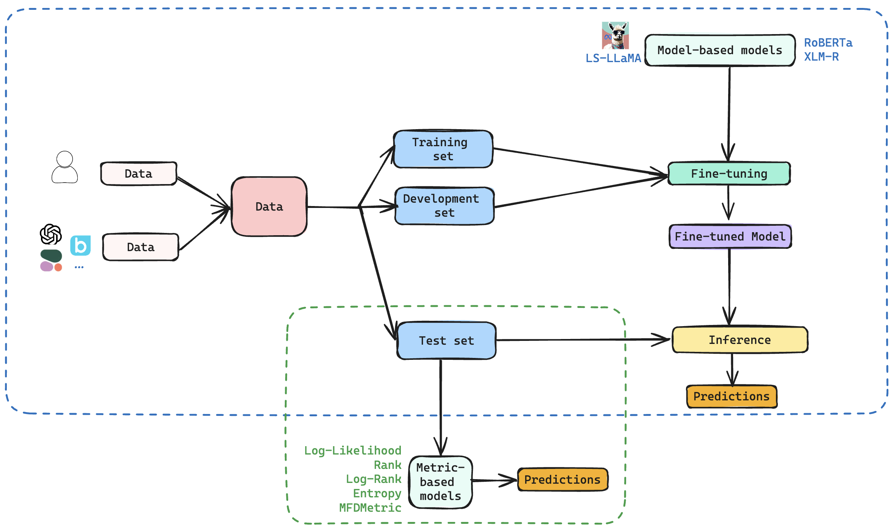
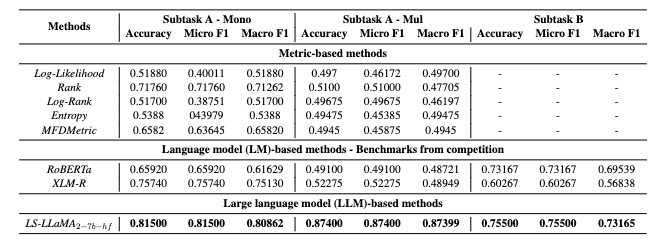

# SemEval-2024 Task 8: Can Fine-tuned Large Language Model Detect Multigenerator, Multidomain, and Multilingual Black-Box Machine-Generated Text?


[Subtasks](#subtasks) | [Data Download Instructions](#data_format) | [Models](#models) | [Contributors](#contributors)

In this repo, we provide our solution to solve two subtasks of [SemEval-2024 Task 8: Multigenerator, Multidomain, and Multilingual Black-Box Machine-Generated Text Detection](https://github.com/mbzuai-nlp/SemEval2024-task8).

## Subtasks

- **Subtask A. Binary Human-Written vs. Machine-Generated Text Classification:** Given a full text, determine whether it is human-written or machine-generated. There are two tracks for subtask A: monolingual (only English sources) and multilingual.

- **Subtask B. Multi-Way Machine-Generated Text Classification:** Given a full text, determine who generated it. It can be human-written or generated by a specific language model.

## <a name="data_format"></a>Data Download Instructions

To download the dataset for this project, follow these steps:

1. Install the `gdown` package using pip:

```
pip install gdown
````

2. Use `gdown` to download the dataset folders by providing the respective file IDs for each subtask:

| Task          | Google Drive Folder Link                                                                                           | File ID                                        |
|---------------|--------------------------------------------------------------------------------------------------------------------|------------------------------------------------|
| Whole dataset | [Google Drive Folder](https://drive.google.com/drive/folders/14DulzxuH5TDhXtviRVXsH5e2JTY2POLi)            | 14DulzxuH5TDhXtviRVXsH5e2JTY2POLi            |
| Subtask A     | [Google Drive Folder](https://drive.google.com/drive/folders/1CAbb3DjrOPBNm0ozVBfhvrEh9P9rAppc)            | 1CAbb3DjrOPBNm0ozVBfhvrEh9P9rAppc            |
| Subtask B     | [Google Drive Folder](https://drive.google.com/drive/folders/11YeloR2eTXcTzdwI04Z-M2QVvIeQAU6-)            | 11YeloR2eTXcTzdwI04Z-M2QVvIeQAU6-            |
| Subtask C     | [Google Drive Folder](https://drive.google.com/drive/folders/16bRUuoeb_LxnCkcKM-ed6X6K5t_1C6mL)            | 16bRUuoeb_LxnCkcKM-ed6X6K5t_1C6mL            |
| All test sets  | [Google Drive Folder](https://drive.google.com/drive/folders/10DKtClzkwIIAatzHBWXZXuQNID-DNGSG?usp=sharing)            | 10DKtClzkwIIAatzHBWXZXuQNID-DNGSG            |

```
gdown --folder https://drive.google.com/drive/folders/<file_id>
```

Make sure to replace `<file_id>` with the respective file IDs provided above when running the `gdown` command for the desired dataset.

## Models



### 1. Metric-based methods

Follow the instruction in [MGTBench](https://github.com/xinleihe/MGTBench).

### 2. LM-based methods

Follow the instruction of the baseline models in [subtaskA/baseline](./subtaskA/baseline) and [subtaskB/baseline](./subtaskB/baseline).

Run the following script to train the model:

- Subtask A:

```
python3 subtaskA/baseline/transformer_baseline.py --train_file_path <path_to_train_file> --test_file_path <path_to_test_file> --prediction_file_path <path_to_save_predictions> --subtask A --model <path_to_model>
```

- Subtask B:

```
python3 subtaskB/baseline/transformer_baseline.py --train_file_path <path_to_train_file> --test_file_path <path_to_test_file> --prediction_file_path <path_to_save_predictions> --subtask B --model <path_to_model>
```

### 3. LLM-based methods

Run the following script to train the model:

```
chmod +x run.sh
./run.sh
```

## Results

### 1. The development set



### 2. The test set

| Model | Subtask A - mono | Subtask A - mul | Subtask B |
|-------|-------------------|-----------------|-----------|
|Baseline| 0.88466 | 0.80887 | 0.74605 |
|LS_LLaMA| 0.85840 | 0.92867 | 0.83117 |
|Rankings| 29/139  | 6/69    | 6/77    |

## Contributors

- [@honghanhh](https://github.com/honghanhh)
- [@nguyennampfiev](https://github.com/nguyennampfiev)
